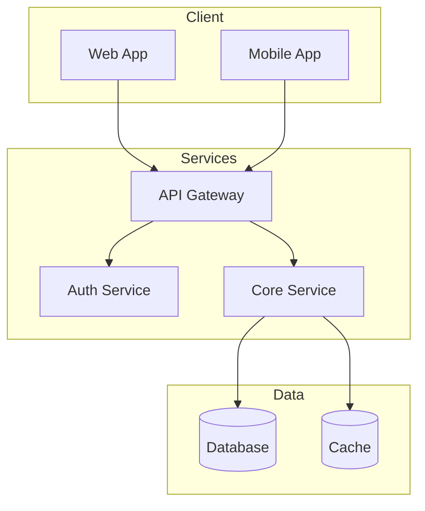
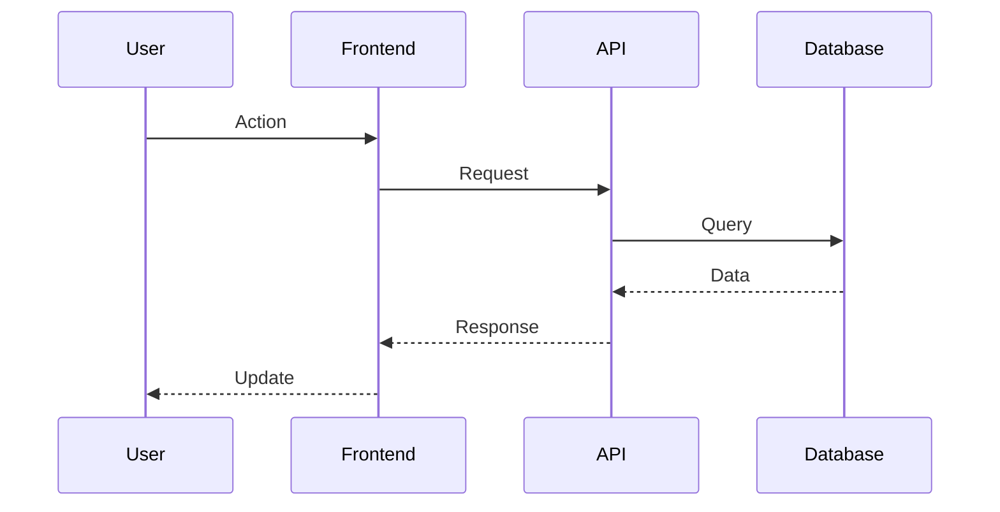
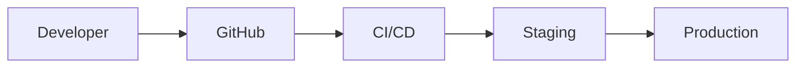

  
SYSTEM ARCHITECTURE

  <h1 style="margin: 0 0 20px 0; font-size: 2.5em; font-weight: 800;">{{title}}</h1>
  
Technical Design Document

---

## Executive Summary

**Purpose:** 

**Scope:** 

**Key Decisions:** 

---

## System Overview

---

## Components

| Component | Technology | Description |
|-----------|------------|-------------|
| Frontend | React | Web UI |
| Backend | Node.js | API Server |
| Database | PostgreSQL | Data Store |
| Cache | Redis | Session Cache |

---

## Data Flow

---

## Security

- [ ] Authentication (JWT)
- [ ] Authorization (RBAC)
- [ ] Encryption (TLS)
- [ ] Input Validation

---

## Deployment

---

## Trade-offs

### Decision 1
**Context:** 
**Decision:** 
**Rationale:** 

---

  {{title}} | Architecture Document | {{date}}

