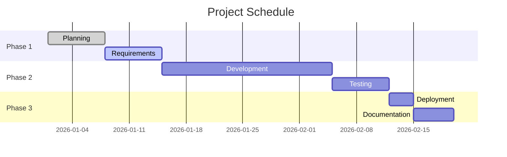

  <h1 style="margin: 0 0 15px 0; font-size: 2.5em; font-weight: 800; text-shadow: 2px 2px 4px rgba(0,0,0,0.2);">{{title}}</h1>
  
Project Dashboard & Status Overview

  

    

      
Active

      
Status

    

    

      
Q1

      
Timeline

    

    

      
High

      
Priority

    

  

---

## Quick Stats

  

    
0%

    
Complete

  

  

    
0

    
Tasks Done

  

  

    
0

    
In Progress

  

  

    
0

    
Days Left

  

---

## Project Timeline

---

## Progress Overview

  

    Overall Progress
    0%
  

  

    

  

### Phase Progress

| Phase | Status | Progress | Due Date |
|-------|:------:|:--------:|----------|
| Planning | Done | 100% | - |
| Requirements | In Progress | 50% | - |
| Development | Not Started | 0% | - |
| Testing | Not Started | 0% | - |
| Deployment | Not Started | 0% | - |

---

## Tasks

> [!warning] Blockers
> List any blockers here

### High Priority
- [ ] 

### Normal Priority
- [ ] 

### Low Priority
- [ ] 

---

## Team & Stakeholders

  

    
Project Lead

    

  

  

    
Developer

    

  

  

    
Stakeholder

    

  

---

## Notes & Decisions

### Key Decisions

### Meeting Notes

### Links & Resources
- 

---

  <strong>{{title}}</strong> | Project Dashboard | Created: {{date}}

